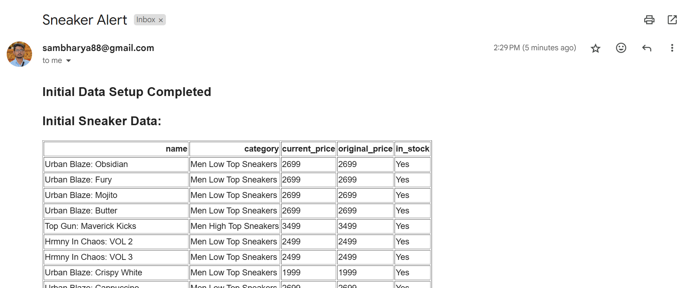
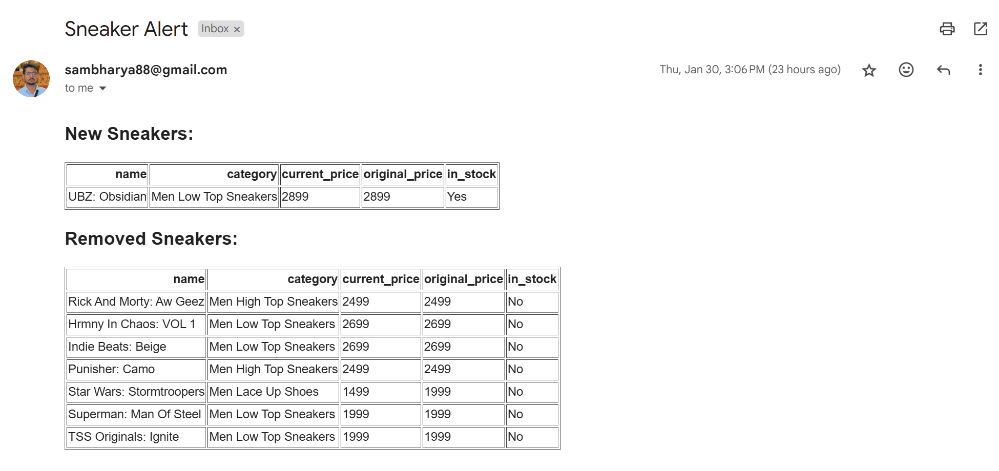

# **PriceTracker-Automation**

## 🚀 Overview
PriceTracker-Automation is an **automated price scraper and tracker** built for **D2C brands**, specifically tracking sneaker prices, discounts, and availability over time. This project efficiently scrapes sneaker pricing data from The Souled Store, stores it in **Google Sheets and CSV**, and **sends automated email alerts** when price or inventory changes are detected.

## 🌟 Features
- ✔️ **Scrapes sneaker product data, prices, availability, and discounts** from The Souled Store  
- ✔️ **Automates periodic price tracking** (daily scrapes via APScheduler)  
- ✔️ **Saves data** in CSV and Google Sheets  
- ✔️ **Sends email alerts** when price changes or inventory is updated  

## 📌 **Why this is valuable?**  
- ✔ **Save time** – No manual checking of competitor prices.  
- ✔ **Optimize pricing** – Identify trends and offer competitive rates.  
- ✔ **Get instant alerts** – Never miss a price drop or inventory change!  

## 💼 Need a Custom Price Tracker?  
Looking for a similar tool tailored to your business? I specialize in **Python automation & web scraping**.  

## 🎯 Use Cases
- 🔹 **E-commerce brands** can monitor competitor pricing strategies.  
- 🔹 **Marketers & analysts** can track product demand based on availability & discounts.  
- 🔹 **Retailers & consultants** can use automated alerts to optimize pricing strategies.  

## 🛠️ Tech Stack
- **Scraping**: Selenium, undetected_chromedriver  
- **Data Handling**: pandas, gspread  
- **Automation**: APScheduler, smtplib (email alerts)  
- **Logging & Error Handling**: Python `logging`  
- **APIs Used**: Google Sheets API, Gmail API  

## 📸 Demo
- **Chrome Driver Run and Data Scraping Sample**:
  

- **Alert Email Samples**

### 1️⃣ **Inital Email of first time setup**

  

### 2️⃣ **Email when there's an update**

  

---

# ⚙️ **Project Setup & API Configuration**

## 🚀 **Google Sheets API (Service Account) + Gmail API (OAuth 2.0) Setup Guide**

### ✅ **Google Sheets API Setup (Service Account)**
(Reason for choosing Service Account: Standard and more secure for corporate projects)

### 1️⃣ **Enable Google Sheets API**
1. Go to **Google Cloud Console** → [Google API Console](https://console.cloud.google.com/)  
2. Click **"Select a Project"** → **Create a new project**  
3. Search for **Google Sheets API**  
4. Click **Enable**  

### 2️⃣ **Create a Service Account**
1. Go to **IAM & Admin** → [Service Accounts](https://console.cloud.google.com/iam-admin/serviceaccounts)  
2. Click **"Create Service Account"**  
3. **Enter a name** (e.g., `Google Sheets API`)  
4. Click **"Create & Continue"**  
5. Click **"Done"**  

### 3️⃣ **Generate Service Account JSON File**
1. In **IAM & Admin → Service Accounts**, click on the service account you created  
2. Go to the **"Keys"** tab  
3. Click **"Add Key"** → **"Create New Key"**  
4. Select **JSON** → Click **Create**  
5. A file (e.g., `service_account_credentials.json`) will be downloaded → **Rename to `service_account_credentials` and move it to your project folder's keys directory(`keys/service_account_credentials.json`)**  

### 4️⃣ **Share Your Google Sheet with the Service Account**
1. Open your **Google Sheet**  
2. Click **Share**  
3. Add the **service account email** (found inside `service_account_credentials.json`)  
   - It will look something like:
     ```
     my-service-account@my-project.iam.gserviceaccount.com
     ```
4. **Give "Editor" access**  
5. Click **Done**  

---

### ✅ **Gmail API Setup (OAuth 2.0)**

### 1️⃣ **Enable Gmail API**
1. Go to **Google Cloud Console** → [Google API Console](https://console.cloud.google.com/)  
2. Click **"Select a Project"** → **Use the same project as Google Sheets**  
3. Search for **Gmail API**  
4. Click **Enable**  

### 2️⃣ **Create OAuth 2.0 Credentials**
1. **Go to** [Credentials Page](https://console.cloud.google.com/apis/credentials)  
2. Click **"Create Credentials"** → **OAuth Client ID**  
3. **Set up OAuth Consent Screen**:  
   - **User Type:** Choose **External**  
   - **App Name:** Enter any name (e.g., "Gmail API App")  
   - **Scopes:** Add:
     ```
     https://www.googleapis.com/auth/gmail.send
     ```
   - Click **Save and Continue**  
4. **Create OAuth Client ID:**  
   - **Application Type:** Choose **Desktop App**  
   - Click **Create**, then **Download `credentials.json`**  
   - **Rename to `oauth2_credentials.json` and move to your project folder's keys directory(`keys/oauth2_credentials.json`)**  

---

# 📂 **Project Structure**
```
project_root/
├── keys/                           # API Credentials
│   ├── oauth2_credentials.json     # Gmail API credentials  
│   ├── service_account.json        # Google Sheets API credentials
│   ├── token.json                  # OAuth token for Gmail API
│
├── sneaker_data/                   # Data Storage
│   ├── sneakers_data.csv          # Current data
│   ├── last_sneakers_data.csv     # Historical data
│
├── venv/                          # Virtual Environment
│
├── price_scraper_dynamic.py       # Main scraper logic
├── data_cleaning_export.py        # Data processing & export
├── data_visualization_and_reporting.py  # Reporting & alerts
├── run_automation.py              # Scheduler & automation
├── requirements.txt               # Dependencies
└── .gitignore                     # Git ignore rules
```

---

# 🏁 **Running the Project**

### 1️⃣ **Setup Virtual Environment(Preffered)**
```bash
python3 -m venv venv
source venv/bin/activate  # On Windows use `venv\Scripts\activate`
```

### 2️⃣ **Install Dependencies**
```bash
pip install -r requirements.txt
```

### 3️⃣ **Run the Scraper(Right now it defaults to single run)**
```bash
python3 main.py
```

---

## 🚨 Notes
Please Ensure your Sheets and Gmail API and keys are set correctly.

---

## 🌟 Contributions
🚀 **Now your project is fully set up for automated sneaker price tracking!**  
Feel free to fork, improve, and submit pull requests! For issues or feature requests, create an issue on the [GitHub repository](#).🚀📊📩

---

## 📜 License
This project is licensed under the **MIT License**.
